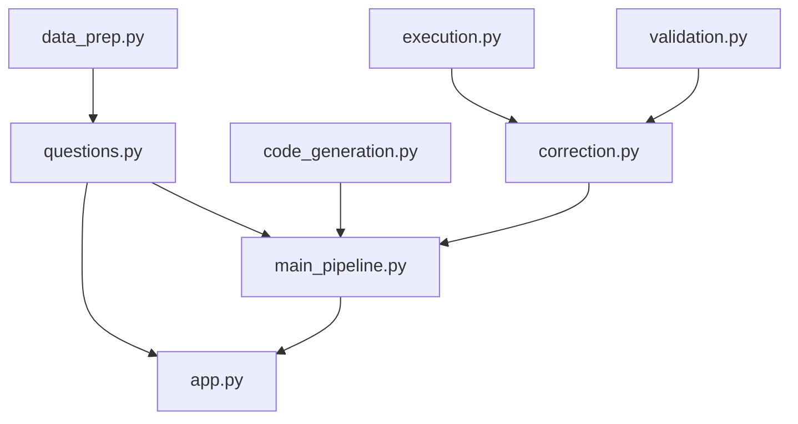
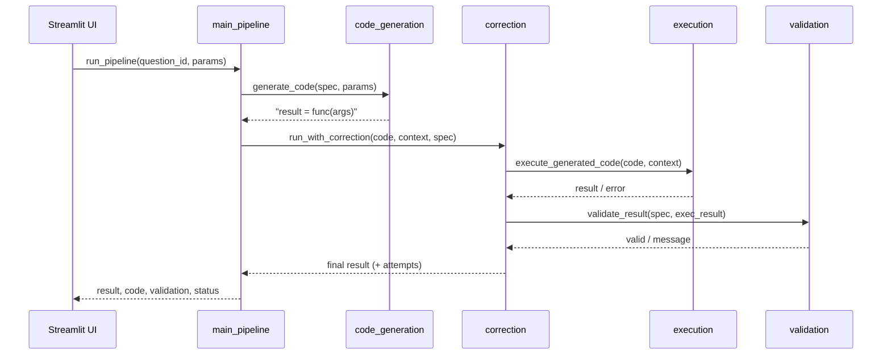

# Architecture and Design Plan (PLAN)

## 1. Architecture overview

The system is a layered pipeline driven by a single question registry. A user
selection flows through code generation, execution, validation, optional
correction, and presentation.

```text
question id -> generate code -> execute -> validate -> correct (if needed) -> present
```

All questions are defined once in `questions.py` (`QUESTION_REGISTRY`); every
other module reads from it, so adding a question is a one-place change.

## 2. Module responsibilities

| Module | Responsibility |
| --- | --- |
| `data_prep.py` | Load the dataset once; one data function per question |
| `questions.py` | `QuestionSpec` registry, parameter definitions, validators |
| `code_generation.py` | Build a runnable code string from a spec + params |
| `execution.py` | `exec()` the generated code; capture result/error/status |
| `validation.py` | Check expected columns, shape, and per-question rules |
| `correction.py` | Rule-based fixes + bounded retry loop |
| `result_presentation.py` | Console presentation |
| `main_pipeline.py` | Wire the modules into `run_pipeline(question_id, params)` |
| `app.py` | Streamlit UI (selection, dynamic inputs, result display) |

## 3. Module dependencies



## 4. Single-run data flow



## 5. Key design decisions

- **Config-driven question registry.** Replaces logic that was duplicated across
  the UI, code generation, validation, and the pipeline with one source of
  truth, preventing the modules from drifting out of sync. (Detailed plan:
  `docs/plans/step-17-registry-refactor.md`.)
- **Template-based generation + `exec()`.** Generated code only ever calls known
  data functions with typed parameters, so it preserves the "generated code"
  concept without the risk of free-text execution.
- **No runtime user-defined questions.** Free-text questions are out of scope:
  they would break validation (no known expected columns) and safe execution.
- **Pinned dark theme** (`.streamlit/config.toml`) so the styling is readable for
  every viewer regardless of browser/OS theme.
- **Dataset kept out of git** (size); retrieval is documented.

## 6. Data schema

`cleaned_merged_dataset.csv` (a cleaned merge of MIMIC-III ADMISSIONS +
LABEVENTS, with lab labels), filtered to rows with a valid `HADM_ID`:

`SUBJECT_ID_x, HADM_ID, ITEMID, CHARTTIME, VALUENUM, VALUEUOM, FLAG,
SUBJECT_ID_y, ADMITTIME, DISCHTIME, DIAGNOSIS, LABEL`.

## 7. Extension point: adding a question

1. Add a data function in `data_prep.py` that returns a DataFrame.
2. Add a `QuestionSpec` to `QUESTION_REGISTRY` in `questions.py`.
3. If a new input type is needed, add it to `PARAM_DEFS`.

No changes to the UI, code generation, validation, or pipeline are required.
