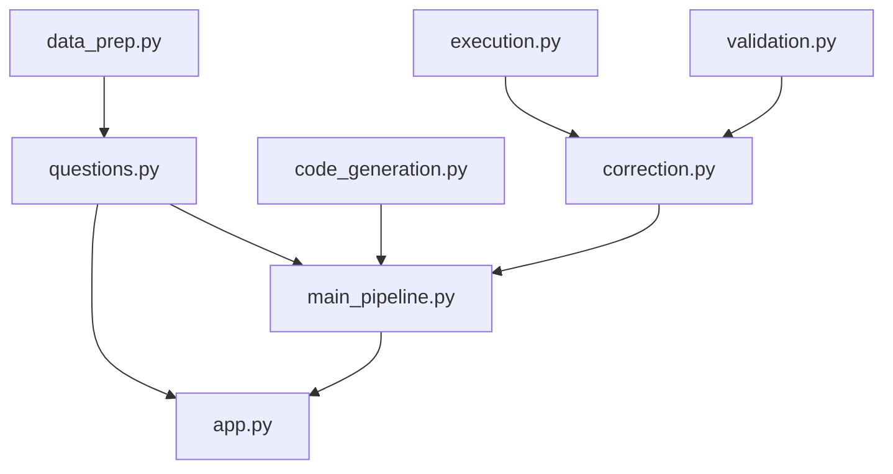
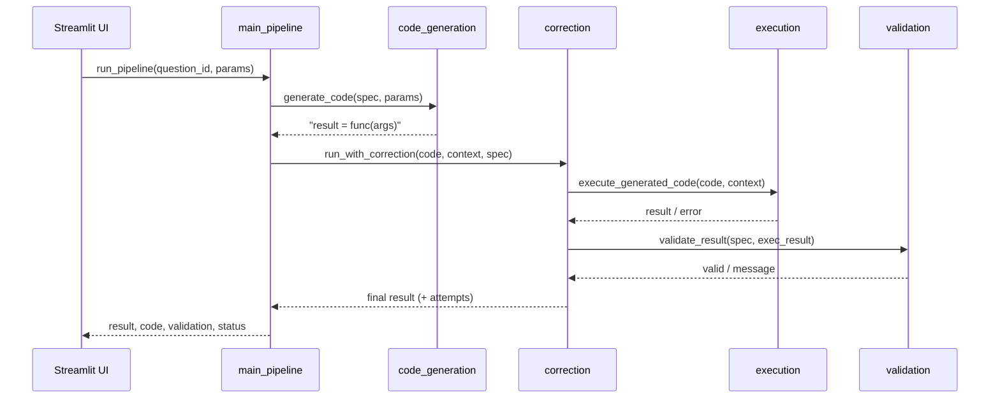

# Architecture and Design Plan (PLAN)

## 1. Architecture overview

The system is a layered pipeline driven by a single question registry. A user
selection flows through code generation, execution, validation, optional
correction, and presentation.

```text
question id -> generate code -> execute -> validate -> correct (if needed) -> present
```

All questions are defined once in `questions.py` (`QUESTION_REGISTRY`); every
other module reads from it, so adding a question is a one-place change.

## 2. Module responsibilities

| Module | Responsibility |
| --- | --- |
| `data_prep.py` | Load the dataset once; one data function per question |
| `questions.py` | `QuestionSpec` registry, parameter definitions, validators |
| `question_router.py` | Controlled NL routing: map a free-text question to a supported question id + params (rule-based; no code generation) |
| `llm_client.py` | Optional LLM client: provider selection (Anthropic/OpenAI/Gemini), retries, mock/none fallback |
| `llm_router.py` | Optional LLM-assisted routing: model returns a JSON question id + params, validated against the registry |
| `code_generation.py` | Build a runnable code string from a spec + params |
| `execution.py` | `exec()` the generated code; capture result/error/status |
| `validation.py` | Check expected columns, shape, and per-question rules |
| `correction.py` | Rule-based fixes + bounded retry loop |
| `result_presentation.py` | Console presentation |
| `main_pipeline.py` | Wire the modules into `run_pipeline(question_id, params)` |
| `app.py` | Streamlit UI (selection, dynamic inputs, result display) |
| `sandbox.py` | AST allowlist + restricted-builtins exec for generated code (the code-gen executor) |
| `code_agent.py` | Programmer agent: the LLM writes a pandas snippet for a free-text question |
| `agent_pipeline.py` | Guarded code-gen loop: programmer -> sandbox -> validator -> refine |
| `presentation_agent.py` | Suggests a chart for a code-gen result (rule-based, optional LLM) |

## 3. Module dependencies



## 4. Single-run data flow



## 5. Key design decisions

- **Config-driven question registry.** Replaces logic that was duplicated across
  the UI, code generation, validation, and the pipeline with one source of
  truth, preventing the modules from drifting out of sync. (Detailed plan:
  `docs/plans/step-17-registry-refactor.md`.)
- **Template-based generation + `exec()`.** Generated code only ever calls known
  data functions with typed parameters, so it preserves the "generated code"
  concept without the risk of free-text execution.
- **No runtime user-defined questions.** Free-text questions are out of scope:
  they would break validation (no known expected columns) and safe execution.
- **Controlled natural-language routing.** An optional NL layer
  (`question_router.py`) maps a free-text question to a supported template plus
  parameters using rule-based keyword matching. It only selects predefined
  questions and never generates code. Routing is rule-based by default with an
  optional LLM-assisted fallback (`llm_router.py` + `llm_client.py`) when a provider
  key is configured; the LLM only selects a template (no code generation).
- **Optional guarded code-generation agent (experimental).** With a provider key,
  an "Advanced" mode lets a programmer agent (`code_agent.py`) write pandas code
  for a free-text question, run in an AgentCoder-style (arXiv 2312.13010)
  generate -> execute -> validate -> refine loop (`agent_pipeline.py`). Safety is
  enforced by `sandbox.py`: an AST allowlist (no imports, dunder/underscore
  attributes, file/network/eval methods, or loops) plus a restricted-`__builtins__`
  exec exposing only `pd` and a read-only `df`, in a worker thread with a soft
  timeout and a row cap; results must pass a deterministic validator before
  display. Orchestration is kept lightweight and in-repo - CrewAI/AutoGen/LangGraph
  were considered and rejected, since extra agents/frameworks mainly add token and
  coordination overhead (a point AgentCoder itself makes about MetaGPT/ChatDev).
  The mode is off by default; templates remain the trusted core.
- **Pinned dark theme** (`.streamlit/config.toml`) so the styling is readable for
  every viewer regardless of browser/OS theme.
- **Dataset kept out of git** (size); retrieval is documented.

## 6. Data schema

`cleaned_merged_dataset.csv` (a cleaned merge of MIMIC-III ADMISSIONS +
LABEVENTS, with lab labels), filtered to rows with a valid `HADM_ID`:

`SUBJECT_ID_x, HADM_ID, ITEMID, CHARTTIME, VALUENUM, VALUEUOM, FLAG,
SUBJECT_ID_y, ADMITTIME, DISCHTIME, DIAGNOSIS, LABEL`.

## 7. Extension point: adding a question

1. Add a data function in `data_prep.py` that returns a DataFrame.
2. Add a `QuestionSpec` to `QUESTION_REGISTRY` in `questions.py`.
3. If a new input type is needed, add it to `PARAM_DEFS`.

No changes to the UI, code generation, validation, or pipeline are required.
Dataset-wide questions that take no input use `params=[]` and a zero-argument
data function (e.g. Q12, "abnormal vs normal counts across all admissions"): the
UI then renders only the Run button and the pipeline calls the function with no
arguments.
