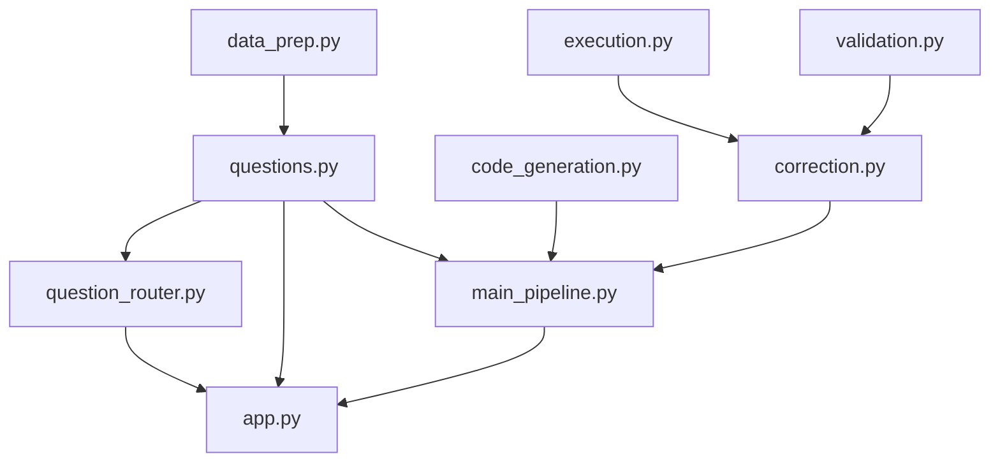

# Clinical Lab Analysis System - Final Report

**Team (row 2):** Hala Hillou, Dana Nmarny, Anas Khoury, Alon Engel

## 1. Summary

The Clinical Lab Analysis System answers a fixed set of predefined clinical
laboratory questions over the MIMIC-III hospital dataset. For each question the
system **generates executable Python code, runs it on a cleaned dataset,
validates the output, applies a rule-based correction when needed, and presents
the result** together with the generated code. It supports **11 question types**
and an optional **controlled natural-language layer** that routes free-text
questions to those templates. No LLM is used in the MVP.

## 2. Problem and goal

Research question: *How can laboratory test results during hospital admission be
used to automatically answer a limited set of clinical analysis questions about
hospitalized patients?*

Raw MIMIC-III lab data is large and hard to query ad hoc. Clinicians and
researchers need quick, reliable answers to a small set of well-defined
questions about an admission, a lab test, or a patient.

## 3. Scope

**In scope:** a registry of predefined questions; the cleaned MIMIC-III merge of
ADMISSIONS + LABEVENTS (with readable lab labels); a Streamlit UI; CSV export; a
controlled (rule-based) natural-language entry point.

**Out of scope:** free-text/unbounded questions, multi-table ad-hoc SQL,
LLM-generated code, writes to the dataset, authentication.

## 4. System architecture

The system is a layered, registry-driven pipeline:

```text
question id -> generate code -> execute -> validate -> correct (if needed) -> present
```

All questions are defined once in `questions.py` (`QUESTION_REGISTRY`); every
other module reads from it, so adding a question is a one-place change.



| Module | Responsibility |
| --- | --- |
| `data_prep.py` | Load the dataset; one data function per question |
| `questions.py` | `QuestionSpec` registry, parameter definitions, validators |
| `question_router.py` | Controlled NL routing to a supported question id + params |
| `code_generation.py` | Build a runnable code string from a spec + params |
| `execution.py` | `exec()` the generated code; capture result/error/status |
| `validation.py` | Check expected columns, shape, and per-question rules |
| `correction.py` | Rule-based fixes + bounded retry loop |
| `result_presentation.py` | Console presentation |
| `main_pipeline.py` | Wire the modules into `run_pipeline(question_id, params)` |
| `app.py` | Streamlit UI |

See `docs/PLAN.md` for the single-run sequence diagram and design decisions.

## 5. Supported questions

| # | Question | Inputs |
| --- | --- | --- |
| 1 | Abnormal lab results for an admission | Admission |
| 2 | Latest value of a lab test | Admission, Lab test |
| 3 | Trend of a lab test over time | Admission, Lab test |
| 4 | All lab tests during an admission | Admission |
| 5 | Compare first vs last value of a lab test | Admission, Lab test |
| 6 | Summary statistics (min/max/mean) of a lab test | Admission, Lab test |
| 7 | Count abnormal vs normal results | Admission |
| 8 | Abnormal results for a specific lab test | Admission, Lab test |
| 9 | List distinct abnormal lab tests | Admission |
| 10 | Lab values within a date range | Admission, Lab test, Date range |
| 11 | All admissions for a patient | Patient |

## 6. Dataset

`cleaned_merged_dataset.csv` (~1,003,949 rows) is a cleaned merge of MIMIC-III
ADMISSIONS + LABEVENTS, filtered to lab rows with a valid `HADM_ID`, with
readable lab labels. It covers 2,839 admissions, 2,234 patients, and 376 lab
test types. Columns: `SUBJECT_ID_x, HADM_ID, ITEMID, CHARTTIME, VALUENUM,
VALUEUOM, FLAG, SUBJECT_ID_y, ADMITTIME, DISCHTIME, DIAGNOSIS, LABEL`.

The file is kept out of git because of its size (>100 MB); see
`docs/decisions/decision-log.md` for how to obtain it.

## 7. Controlled AI / NLP (no LLM)

The system includes a controlled AI/NLP question-routing layer
(`question_router.py`) that maps a natural-language question to exactly one
supported template and extracts its parameters. The router only selects a
predefined question - it never generates or executes free-form code, and it
rejects anything it cannot map (including unknown admission/patient IDs).

The system does not use an LLM in the current MVP. This was an intentional
design decision: the supported questions are predefined, and template-based code
generation provides more reliable, testable, and reproducible behavior. An
LLM-based natural-language interface (and an LLM-assisted router) is proposed as
future work and can replace the rule-based router without changing the pipeline.

## 8. How code generation, validation, and correction work

- **Generation:** `generate_code(spec, params)` builds a call like
  `result = get_lab_trend(107521, 51221)` from the question's data function and
  its parameters.
- **Execution:** `execute_generated_code` runs the snippet against the prepared
  data functions and captures success/result/error.
- **Validation:** checks the result is a non-empty DataFrame with the expected
  columns, plus a per-question rule (e.g. exactly one row for "latest value",
  time-ascending order for trends, only abnormal rows for abnormal queries).
- **Correction:** a bounded, rule-based retry loop fixes common function-name
  typos and re-runs; it matches whole identifiers only.

## 9. Evaluation and testing

**MVP evaluation** (across multiple admissions and patients) confirmed all
question types execute and validate correctly, for example:

| Question | Example | Result |
| --- | --- | --- |
| 1 | HADM 145834 | Abnormal results returned (FLAG = abnormal) |
| 2 | HADM 199884, Chloride | Latest value 103 mEq/L |
| 3 | HADM 107521, Hematocrit | Decreasing trend 57.9% -> 44.4% |
| 4 | HADM 158675 | All lab tests listed |
| 5 | HADM 177047, pO2 | First 82, last 103, difference +21 mm Hg |

**Automated tests:** 72 tests pass with ~94% line coverage (85% gate enforced in
`pyproject.toml`), including unit tests for every module and an end-to-end test
exercising all 11 questions plus natural-language routing and edge cases. See
`docs/TEST_REPORT.md` and the per-question screenshots in `docs/assets/screenshots/`.

## 10. User interface

A dark-themed Streamlit app: question selection (with a category filter and a
per-question help caption), parameter inputs rendered dynamically per question,
an optional natural-language box, and a results area with summary metric cards,
a trend chart (with axis labels and units), color-coded status, and tabs for the
result, generated code, validation details, and correction attempts.

## 11. How to run

```bash
uv sync
uv run streamlit run app.py     # UI
uv run pytest                   # tests + coverage
```

(Place `cleaned_merged_dataset.csv` in the project root first.)

## 12. Limitations and future work

- Predefined questions only (by design). Future: an LLM-assisted router and a
  broader question set.
- Single local dataset; no live SQL backend.
- Empty results for valid-but-unmatched filters are reported as "no records".

## 13. Team and responsibilities

- **Hala, Dana:** supported question definition, dataset preparation, question
  selection and data-preparation components.
- **Anas, Alon:** code generation, execution, validation, correction, result
  presentation, the registry refactor, the NL router, UI, and tests.
- **All four:** test cases, integration, and evaluation.

## 14. Repository layout

```text
app.py                     Streamlit UI
main_pipeline.py           End-to-end pipeline
questions.py               Question registry (single source of truth)
question_router.py         Controlled natural-language router
data_prep.py               Dataset load + per-question data functions
code_generation.py         Template code generation
execution.py               Safe execution wrapper
validation.py              Output validation
correction.py              Rule-based correction loop
result_presentation.py     Console presentation
tests/                     Unit + end-to-end tests
docs/                      PRD, PLAN, TODO, REPORT, DEMO, SLIDES, TEST_REPORT, decisions, screenshots
pyproject.toml, uv.lock    Dependencies (managed with uv)
```
