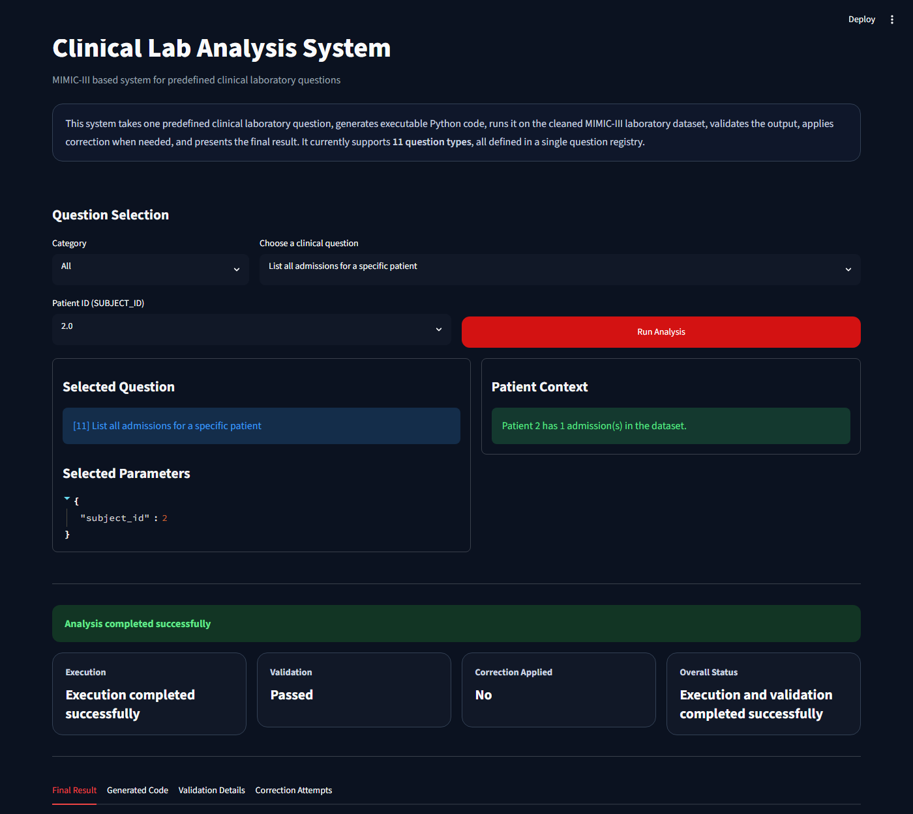

# Test Report

Automated tests for the Clinical Lab Analysis System.

## Summary

- **56 tests pass**, **0 failures**.
- **94% line coverage** (target: 85%).
- Layers covered: unit tests for every logic module + an end-to-end test for the
  Streamlit UI that exercises **all 11 questions**.

Run them with:

```bash
pip install -r requirements.txt
python -m pytest tests/ --cov=data_prep --cov=questions --cov=code_generation \
  --cov=execution --cov=validation --cov=correction --cov=result_presentation \
  --cov=main_pipeline --cov=app --cov-report=term-missing
```

## Coverage

| Module | Coverage |
| --- | --- |
| `code_generation.py` | 100% |
| `correction.py` | 100% |
| `execution.py` | 100% |
| `result_presentation.py` | 100% |
| `validation.py` | 96% |
| `data_prep.py` | 95% |
| `main_pipeline.py` | 93% |
| `app.py` | 92% |
| `questions.py` | 92% |
| **Total** | **94%** |

## End-to-end results per question

Each question is selected in the app, the correct parameter widgets are
asserted to render, the analysis is run, and the result components are checked.
These were verified both via Streamlit's `AppTest` harness (`tests/test_e2e_app.py`)
and in a real headless Chromium browser (screenshots in `docs/assets/screenshots/`).

| # | Question | Widgets shown | Expected result | Status |
| --- | --- | --- | --- | --- |
| 1 | Abnormal lab results | Admission | Table, all `FLAG = abnormal` | Pass |
| 2 | Latest lab value | Admission, Lab Test | Exactly 1 row | Pass |
| 3 | Lab trend over time | Admission, Lab Test | Time-sorted table + line chart | Pass |
| 4 | All lab tests | Admission | Table of all tests | Pass |
| 5 | First vs last value | Admission, Lab Test | 1-row comparison incl. difference | Pass |
| 6 | Summary statistics | Admission, Lab Test | 1 row: count/min/max/mean | Pass |
| 7 | Abnormal vs normal counts | Admission | 1 row: total/abnormal/normal | Pass |
| 8 | Abnormal results for a lab | Admission, Lab Test | Abnormal rows, or graceful "no records" | Pass |
| 9 | Distinct abnormal tests | Admission | Table of tests with abnormal counts | Pass |
| 10 | Values in a date range | Admission, Lab Test, Date range | Time-sorted table + line chart | Pass |
| 11 | All admissions for a patient | Patient ID | Table of the patient's admissions | Pass |

## Edge cases covered

- **No-records path**: question 8 with a lab that has no abnormal readings shows
  the neutral "no matching records" banner instead of an error.
- **Correction loop**: a generated function-name typo is auto-corrected and re-run.
- **Regression guard**: the typo corrector no longer corrupts the valid name
  `get_abnormal_results_for_lab` (it matches whole identifiers only).
- **Missing data**: data functions return empty frames for unknown admissions/patients.
- **Validation failures**: execution error, `None` result, non-DataFrame, missing
  columns, empty frame, and failing per-question rules are all handled.

## Example (question 11, patient overview)


