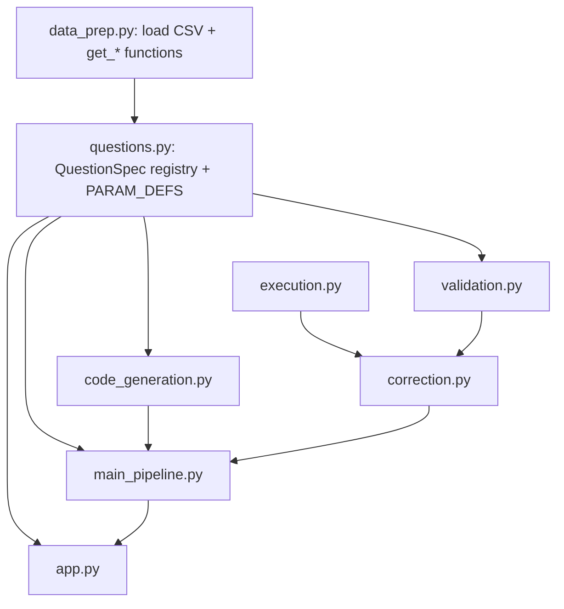

# Step 17 - Registry-Driven Questions, New Questions, and UI Polish

> Plan for implementing Step 17 ("improve and polish") of the Clinical Lab Analysis System.
> Mirrored from the working plan so the team can track it in the repo.

## Status checklist

- [ ] **registry** - Create `questions.py` (`QuestionSpec` dataclass, `PARAM_DEFS`, `QUESTION_REGISTRY`, IDs 1-5 preserved); move data-prep functions + CSV load into `data_prep.py` to keep imports acyclic.
- [ ] **codegen** - Refactor `code_generation.py` to build the code string from a `QuestionSpec` + params; remove leftover mock functions and the mock `__main__` block.
- [ ] **validation** - Refactor `validation.py` to read `expected_columns` and optional `extra_validate` from the spec instead of hardcoded per-id branches.
- [ ] **pipeline** - Refactor `main_pipeline.py` to build the execution context automatically from the registry and look up the spec by question id.
- [ ] **ui** - Refactor `app.py` to render the dropdown and parameter widgets from the registry; fix the always-green success banner; optional trend chart and question grouping.
- [ ] **new-questions** - Add new question specs Q6-Q9 (core) and optionally Q10-Q11 (date range / patient level) as single-object additions to the registry.
- [ ] **deliverables** - Add `requirements.txt` and `README.md`; update `test_correction.py` and `test_result_presentation.py` to new signatures.
- [ ] **smoke-test** - Run the pipeline end-to-end for every question id and verify execution + validation pass.

## Goal

Implement Step 17 ("improve and polish") from the team guide: support more than 5 questions, improve the UI, and clean up. The core enabler is making questions **data-driven** instead of hardcoded.

## Should questions be "dynamic"?

There are two meanings, and they have opposite answers:

- **Developer-dynamic (a registry): YES, recommended.** Today a question is hardcoded in 4 files that must stay in sync: the dropdown + param logic in `app.py` (`if question_type in [2, 3, 5]`), the templates in `code_generation.py`, `EXPECTED_COLUMNS` + rules in `validation.py`, and the functions/`context` in `main_pipeline.py`. Centralizing this into one `QuestionSpec` list means every module reads from one source of truth, so adding a question is a single edit and the sections **cannot** drift apart. This makes the system safer, not riskier.
- **Runtime user-defined (users type their own questions): NO, out of scope.** The team guide explicitly lists "support free-text unlimited questions" and "make correction fully autonomous" under "What would break the plan." It would also break validation (no known `expected_columns`) and safe execution. Noted as future work only.

## Target architecture

A new `questions.py` registry is the single source of truth. Proposed spec shape:

```python
@dataclass
class QuestionSpec:
    id: int
    label: str
    params: list[str]                 # e.g. ["hadm_id", "itemid"]
    func: Callable                    # data-prep function
    expected_columns: list[str]
    extra_validate: Optional[Callable] = None  # (df) -> (bool, message)
```

Plus a `PARAM_DEFS` map describing how the UI renders each param (`hadm_id`, `itemid`, and later `subject_id` / `date_range`). The UI renders exactly the widgets a question declares, so it generalizes automatically.

Module dependencies stay acyclic:



The "generated code" concept is preserved: `generate_code(spec, params)` still builds a string like `result = get_lab_summary_stats(199884, 50902)` from the spec, and `execution.py` still `exec()`s it. IDs 1-5 stay unchanged so the existing Step 16 evaluation remains valid.

## New question types (feasible with current columns)

Core additions (no new UI param types, low risk):

- **Q6 - Summary statistics of a lab test in an admission** (min/max/mean/count of `VALUENUM`). Params: `hadm_id`, `itemid`.
- **Q7 - Count of abnormal vs normal results in an admission** (group by `FLAG`). Params: `hadm_id`.
- **Q8 - Abnormal results for a specific lab test** (`HADM_ID` + `ITEMID` + `FLAG == abnormal`). Params: `hadm_id`, `itemid`.
- **Q9 - All abnormal flagged lab tests in an admission** - this restores the question the team originally planned as Q4 in the guide (current Q4 is "all tests"). Params: `hadm_id`.

Optional stretch (introduce new param types; proves the registry truly generalizes):

- **Q10 - Lab values within a date range** (`CHARTTIME` between bounds). Params: `hadm_id`, `itemid`, `date_range`.
- **Q11 - All admissions for a patient** (`SUBJECT_ID`). Params: `subject_id`.

## UI improvements (`app.py`)

- Render question dropdown and parameter widgets from the registry (delete the hardcoded `if question_type in [2, 3, 5]` block).
- Fix the success banner: it currently always shows "Analysis completed successfully" even on failure; drive it from `overall_status`.
- Optionally group questions by category and add a simple `st.line_chart` for the trend question (Q3).
- Keep existing dark-theme styling and the result/code/validation/attempts tabs.

## Cleanup and deliverables (Step 18 adjacent)

- Remove leftover mock functions and the mock `__main__` block from `code_generation.py`.
- Add `requirements.txt` (`streamlit`, `pandas`) and a short `README.md` (how to run, architecture, supported questions).
- Update `test_correction.py` / `test_result_presentation.py` to the new signatures.

## Risks / notes

- Keep question IDs 1-5 stable so docs/evaluation stay accurate.
- `exec()` is retained intentionally (controlled templates, typed int/str params) - it is the project's "generated code" mechanism, not a new risk.
- Data-prep functions move to `data_prep.py` to avoid circular imports; `app.py` will import `merged_data` from there (or via a re-export in `main_pipeline.py`).
- Smoke-test the full pipeline for every question id after implementation.
